# 作业提交模板

```
.
├── code/                   # 所有实验代码
└── README.md               # 项目核心文档
```

## 研究目的

探究 MapReduce 中 Reduce 任务的启动时机及其对作业性能的影响。

## 研究内容

围绕 Reduce 任务的启动时机展开分析，重点包括：

- Reduce 是否在所有 Map 任务完成后才开始执行？
- 不同启动时机对 Job 的执行效率与资源利用率的影响。

## 实验

### 实验环境

#### 硬件环境

集群节点与规格（核数/内存/磁盘）：

| 节点      | CPU | 内存 | 磁盘      |
| --------- | --- | ---- | --------- |
| hadoop001 | 8C  | 32G  | 140GB SSD |
| hadoop002 | 8C  | 32G  | 40GB SSD  |
| hadoop003 | 4C  | 16G  | 40GB SSD  |

功能组件部署：

- HDFS
  - NameNode：hadoop001
  - SecondaryNameNode：hadoop003
  - DataNode：hadoop001 / hadoop002 / hadoop003
- YARN
  - ResourceManager：hadoop002
  - NodeManager：hadoop001 / hadoop002 / hadoop003

（或表格视图）

| 组件 | 角色              | 节点                              |
| ---- | ----------------- | --------------------------------- |
| HDFS | NameNode          | hadoop001                         |
| HDFS | SecondaryNameNode | hadoop003                         |
| HDFS | DataNode          | hadoop001 / hadoop002 / hadoop003 |
| YARN | ResourceManager   | hadoop002                         |
| YARN | NodeManager       | hadoop001 / hadoop002 / hadoop003 |

#### 软件环境

| 组件   | 版本         |
| ------ | ------------ |
| Hadoop | 3.2.4        |
| Java   | OpenJDK 8    |
| Maven  | 3.6          |
| OS     | Ubuntu 20.04 |

### 实验负载

- 数据集与工作负载说明：
  - 词频统计（WordCount）
  - TopK
  - 去重（Dedup）
- 数据生成方式：各子实验根目录下执行 `./scripts/generate_data.py`
- 负载规模：1GB、3GB、5GB

### 实验步骤

#### 部署与验证

- 三个节点用户名均为 ecs-user。启动并验证 HDFS 与 YARN：
  - 使用 jps 检查进程：
    - hadoop001：
      
    - hadoop002：
      
    - hadoop003：
      
  - 访问 Web UI：
    - HDFS NameNode（hadoop001:9870）：
      
    - YARN ResourceManager（hadoop002:8080）：
      
  - 截图需包含用户名等个性化信息以佐证真实性。

#### 数据生成

- 在各子实验目录执行数据生成脚本，并记录数据量与耗时（示例以 wordcount 为例）：
  
- 生成完毕后，将数据上传至 HDFS：
  

#### 作业提交

- 依次提交 WordCount / TopK / Dedup 作业，记录：
  - Map/Reduce 任务数、启动时间线
  - Shuffle 阶段耗时、Reduce 启动比例（早启动/晚启动）
  - 总执行时间与资源使用情况

监测脚本与用途：

| 脚本路径                       | 作用说明                                |
| ------------------------------ | --------------------------------------- |
| scripts/gemini_monitor_plus.sh | 监测 yarn-child 进程（CPU/内存/网络等） |
| scripts/collect_metrics.sh     | 监测任务执行时间与系统资源使用情况      |
| scripts/batch_experiment.sh    | 批量提交并从 JobHistoryServer 提取指标  |

终端与节点分配（共 6 个终端）：

| 终端/节点  | 需运行脚本                     |
| ---------- | ------------------------------ |
| 任意一终端 | scripts/batch_experiment.sh    |
| hadoop002  | scripts/collect_metrics.sh     |
| hadoop002  | scripts/gemini_monitor_plus.sh |
| hadoop003  | scripts/collect_metrics.sh     |
| hadoop003  | scripts/gemini_monitor_plus.sh |
| hadoop001  | scripts/gemini_monitor_plus.sh |

示例输出截图：

- 批量实验终端：
  
- 远端数据采集（4 个终端）：
  
  
  
  
- hadoop001 本地采集：
  

#### 结果采集

- 作业完成后，scripts/batch_experiment.sh 自动汇总所有所需数据与指标。
- 任务与系统监控示例：
  - Map/Reduce 任务监控：
    
  - 系统监控：
    
- 数据目录概览：
  

### 实验分析

基于不同规模（1GB-5GB）的 WordCount 实验结果显示， **slowstart=0.5 表现最佳** ，特别是在 5GB 场景下较最差配置缩短了约 36% 的耗时。WordCount 属于 Shuffle 密集型任务，0.5 的设置实现了最佳的流水线并行，既避免了 slowstart=0.1 过早启动导致的资源抢占，也消除了 slowstart=1.0 串行执行带来的网络空闲与后期拥堵。该配置有效平衡了计算与网络 I/O 负载，建议作为此类作业的默认优化参数。

基于 **数据去重（Data Deduplication）** 任务的实验结果分析， **较低的 slowstart 阈值（0.1 - 0.3）整体表现最佳** 。在 1GB 和 3GB 数据规模下，**slowstart=0.3** 均取得了最短执行时间；而在 5GB 规模下， **slowstart=0.1** （130s）略优于 0.3，且相比最差的 slowstart=1.0（179s）性能提升了约 **27%** 。去重任务通常具有 **Map 输出量大、Shuffle 负载高** 的特点。从甘特图可见，较低的 slowstart 允许 Reduce 尽早拉取数据，利用 Map 阶段的空闲网络带宽实现 **“计算与传输的流水线重叠”** ，有效避免了后期网络拥堵。综合考虑资源占用与性能稳定性，建议将该参数设置为 **0.3** 。

基于 **Top K 最大数** 任务的实验结果分析，该任务对 slowstart 参数的敏感度与 WordCount 和 Deduplication 有所不同。在 1GB、3GB 和 5GB 场景下， **slowstart=0.3 表现最为出色** （分别为 39s、52s 和 81s），始终保持着最短的执行时间。Top K 任务通常 Map 阶段计算量较小，但会产生大量候选数据，Reduce 阶段则需进行全局排序。slowstart=0.3 允许 Reduce 在 Map 早期就开始 Shuffle 传输数据，充分利用了网络带宽，且避免了 slowstart=0.1 过早启动导致的资源过度竞争。对于 Top K 这类数据缩减型任务，建议将该参数设置为 **0.3** 以获得最佳吞吐量。

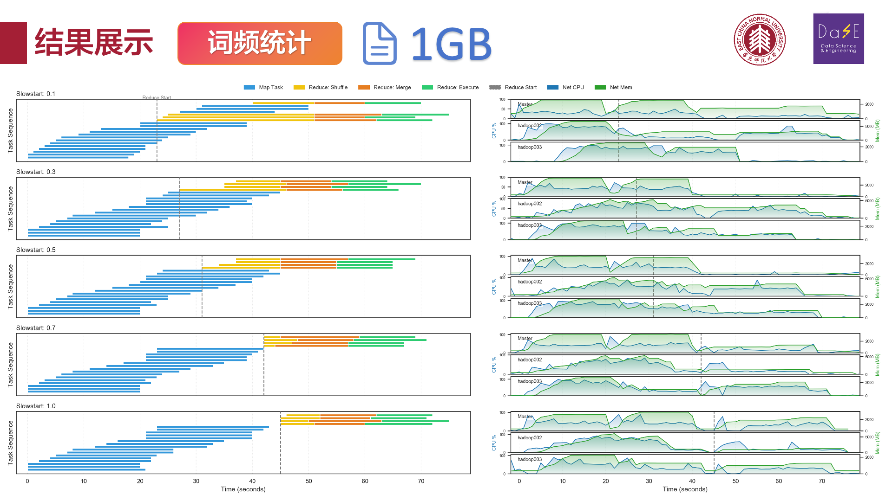
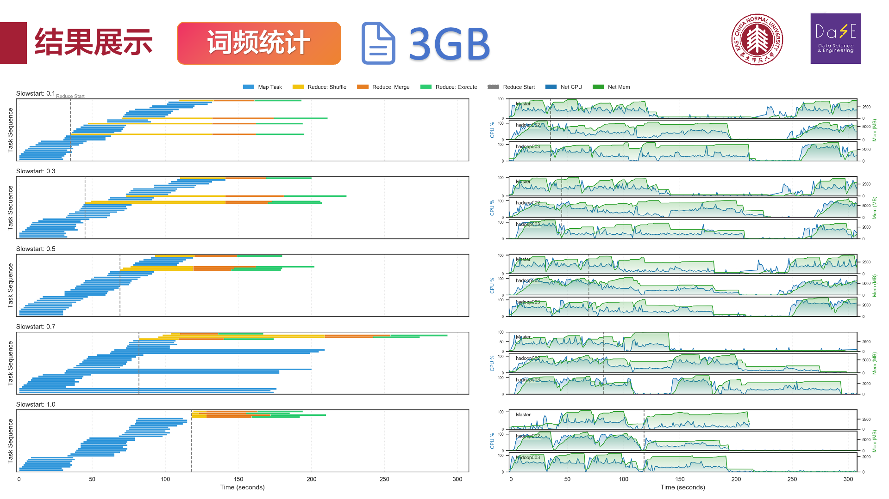
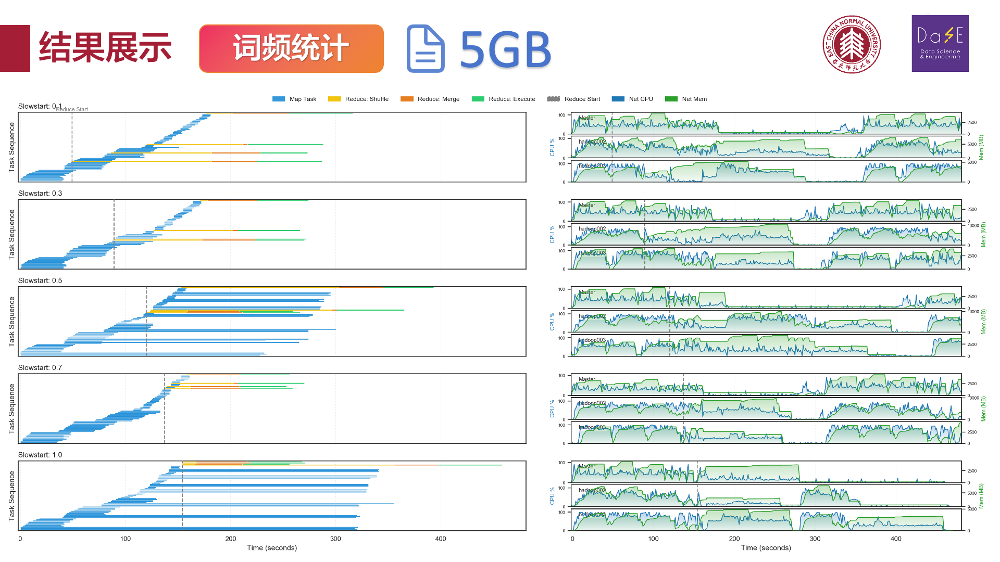
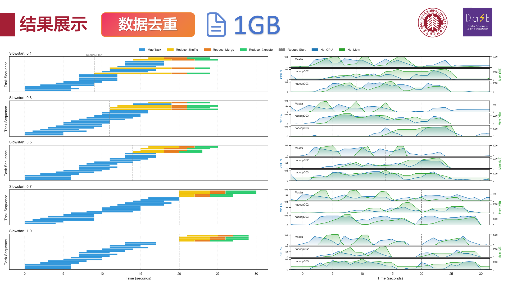
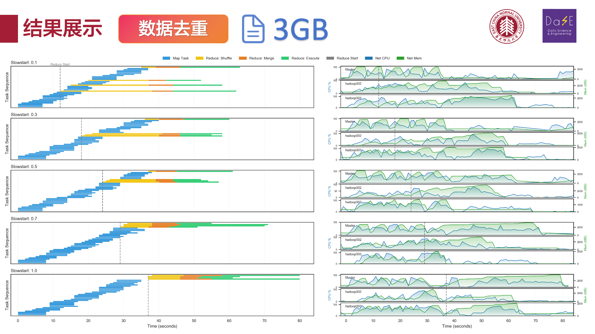
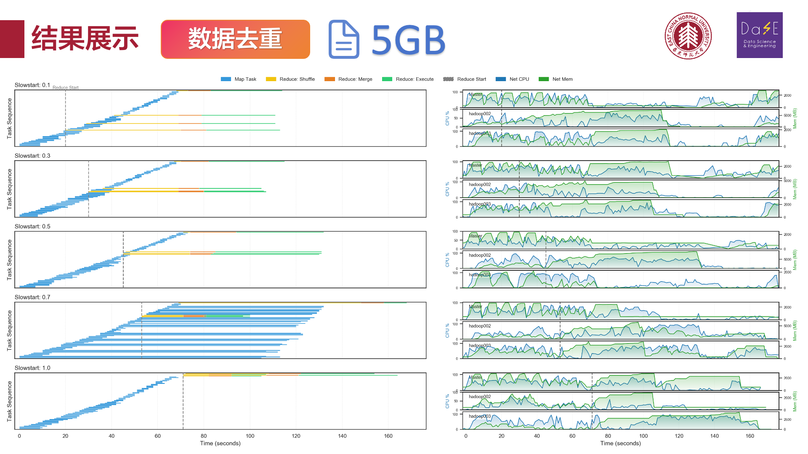
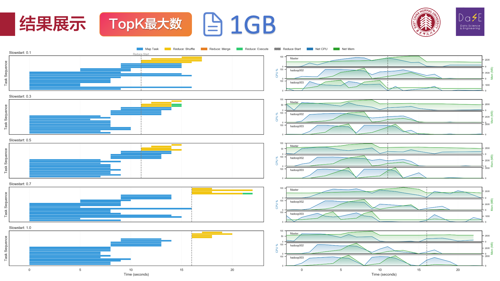
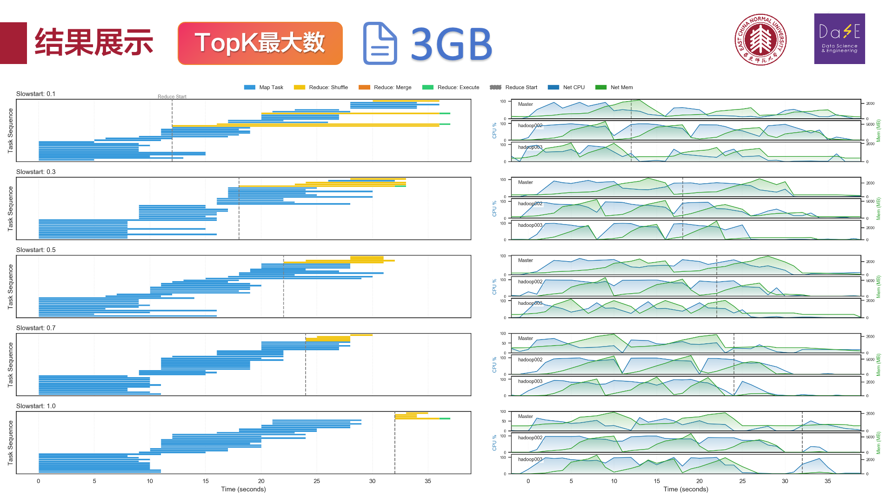
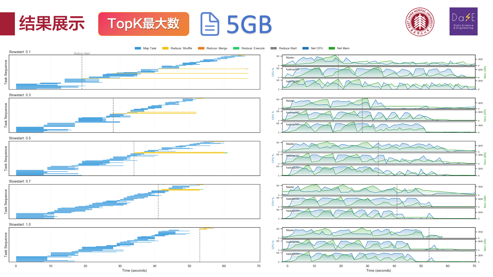
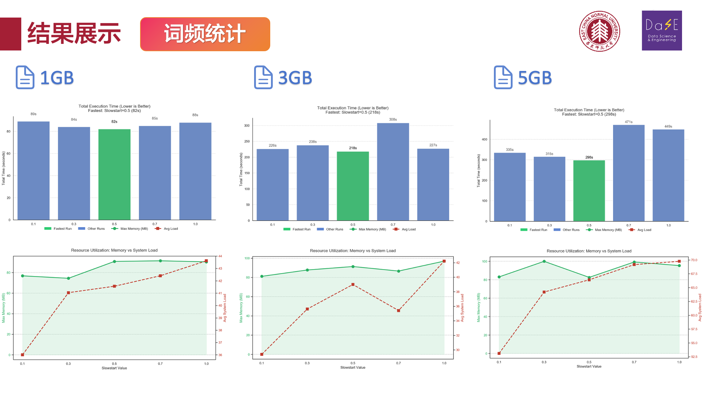
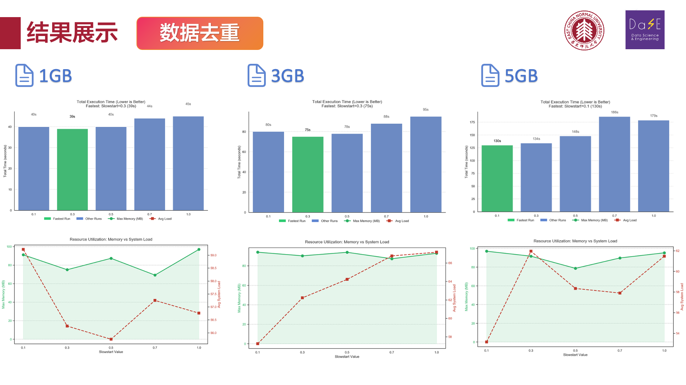
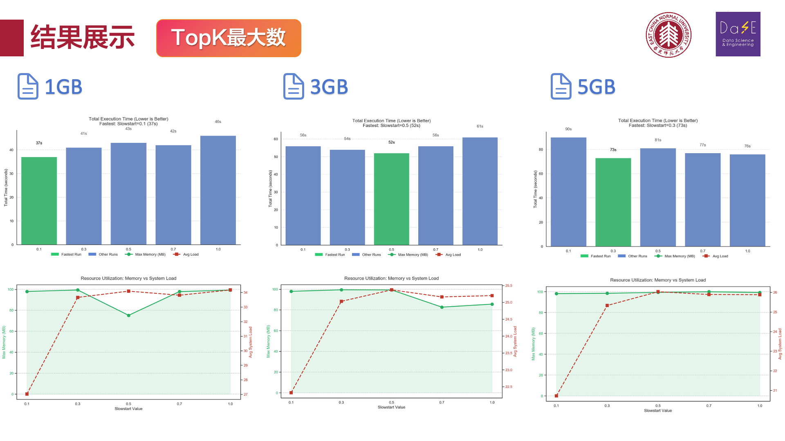

### 总结

**MapReduce 作业的性能高度依赖于** **计算（Compute）** **与** **数据传输（Shuffle）** **之间的平衡。实验表明，**slowstart\*\* **的最佳设置区间通常集中在 0.3 至 0.5 之间**，这不仅优于 Hadoop 默认的激进配置（0.05），也显著优于保守的串行配置（1.0）。\*\*

### 任务类型与最佳参数对应

- **高 Shuffle/IO 密集型任务（如 Deduplication、TopK）：**

  - 最佳配置：slowstart = 0.3
  - **原因：** **这类任务 Map 输出数据量大（去重需全量传输，TopK 需传输候选项），网络 I/O 是主要瓶颈。较低的阈值（0.3）允许 Reduce 尽早启动并利用 Map 阶段的空闲带宽进行数据拉取（Pipelining），最大程度“隐藏”了网络传输耗时。**

- **均衡/计算密集型任务（如 WordCount）：**

  - 最佳配置：slowstart = 0.5
  - **原因：** **WordCount 的 Map 阶段涉及大量字符串解析（CPU 密集），且 Shuffle 数据量亦大。设置为 0.5 既保证了 Map 任务有足够的资源先行处理，又在后期实现了计算与传输的完美流水线重叠，避免了过早启动导致的 CPU 资源争抢。**

### 综合调优建议

- **拒绝两端**：**slowstart=1.0**（完全串行）在所有实验中均为**最差或次差**选择，它导致了严重的网络带宽浪费和作业拖延；而**slowstart=0.1** 在集群资源有限时容易引发资源死锁或 Map 饥饿。
- **默认推荐**：在未知具体任务特性的生产环境中，建议将**mapreduce.job.reduce.slowstart.completedmaps** **设置为** **0.3 ~ 0.5** 作为通用基准，这能覆盖绝大多数场景下的性能最优解。

### 分工

朱宇瑄: 集群环境配置，wordcount 代码实现，性能监测脚本实现

陈亦楠：集群环境配置，实验结果可视化，实验结果分析

李欣昊：去重任务代码实现，实验结果可视化

周孙睿：top-k 任务代码实现
