# 作业提交模板

```
.
├── code/                   # 所有实验代码
└── README.md               # 项目核心文档
```

## 研究目的

探究 MapReduce 中 Reduce 任务的启动时机及其对作业性能的影响。

## 研究内容

围绕 Reduce 任务的启动时机展开分析，重点包括：

- Reduce 是否在所有 Map 任务完成后才开始执行？
- 不同启动时机对 Job 的执行效率与资源利用率的影响。

## 实验

### 实验环境

#### 硬件环境

集群节点与规格（核数/内存/磁盘）：

| 节点      | CPU | 内存 | 磁盘      |
| --------- | --- | ---- | --------- |
| hadoop001 | 8C  | 32G  | 140GB SSD |
| hadoop002 | 8C  | 32G  | 40GB SSD  |
| hadoop003 | 4C  | 16G  | 40GB SSD  |

功能组件部署：

- HDFS
  - NameNode：hadoop001
  - SecondaryNameNode：hadoop003
  - DataNode：hadoop001 / hadoop002 / hadoop003
- YARN
  - ResourceManager：hadoop002
  - NodeManager：hadoop001 / hadoop002 / hadoop003

（或表格视图）

| 组件 | 角色              | 节点                              |
| ---- | ----------------- | --------------------------------- |
| HDFS | NameNode          | hadoop001                         |
| HDFS | SecondaryNameNode | hadoop003                         |
| HDFS | DataNode          | hadoop001 / hadoop002 / hadoop003 |
| YARN | ResourceManager   | hadoop002                         |
| YARN | NodeManager       | hadoop001 / hadoop002 / hadoop003 |

#### 软件环境

| 组件   | 版本         |
| ------ | ------------ |
| Hadoop | 3.2.4        |
| Java   | OpenJDK 8    |
| Maven  | 3.6          |
| OS     | Ubuntu 20.04 |

### 实验负载

- 数据集与工作负载说明：
  - 词频统计（WordCount）
  - TopK
  - 去重（Dedup）
- 数据生成方式：各子实验根目录下执行 `./scripts/generate_data.py`
- 负载规模：1GB、3GB、5GB

### 实验步骤

#### 部署与验证

- 三个节点用户名均为 ecs-user。启动并验证 HDFS 与 YARN：
  - 使用 jps 检查进程：
    - hadoop001：
      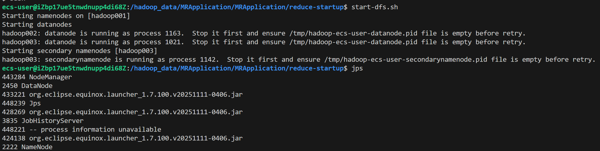
    - hadoop002：
      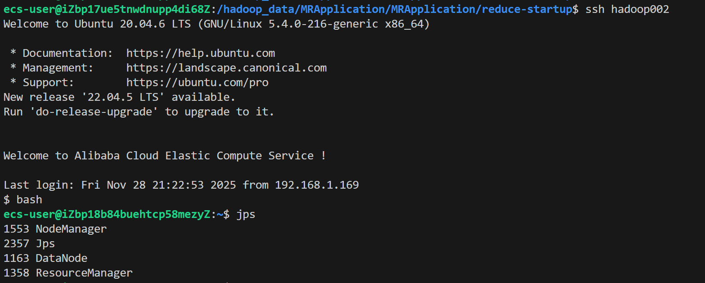
    - hadoop003：
      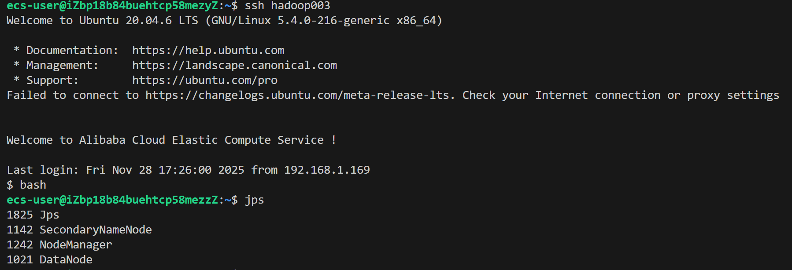
  - 访问 Web UI：
    - HDFS NameNode（hadoop001:9870）：
      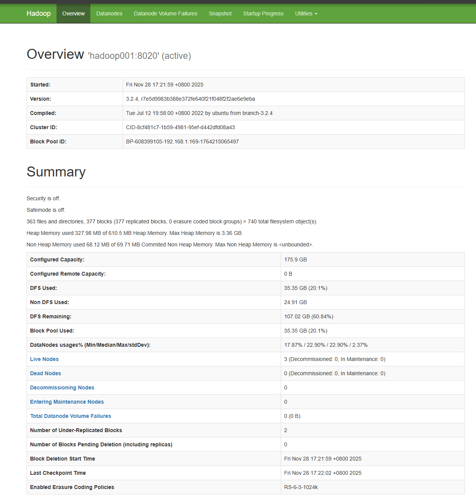
    - YARN ResourceManager（hadoop002:8080）：
      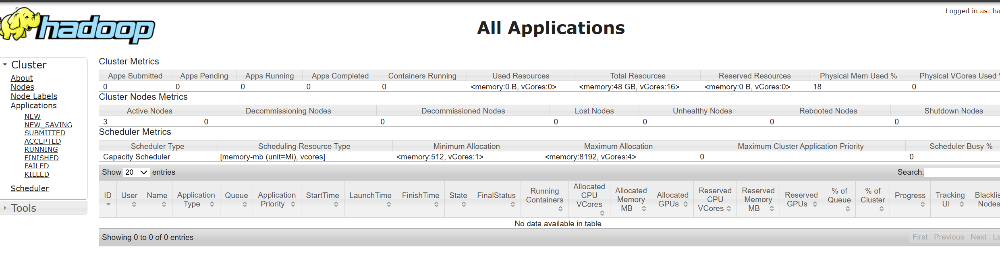
  - 截图需包含用户名等个性化信息以佐证真实性。

#### 数据生成

- 在各子实验目录执行数据生成脚本，并记录数据量与耗时（示例以 wordcount 为例）：
  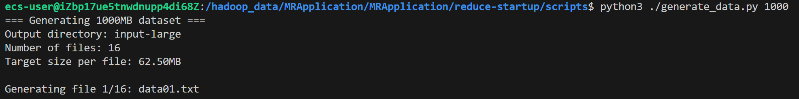
- 生成完毕后，将数据上传至 HDFS：
  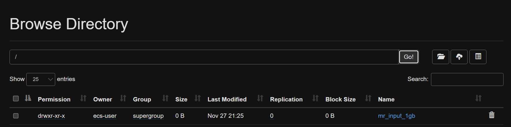

#### 作业提交

- 依次提交 WordCount / TopK / Dedup 作业，记录：
  - Map/Reduce 任务数、启动时间线
  - Shuffle 阶段耗时、Reduce 启动比例（早启动/晚启动）
  - 总执行时间与资源使用情况

监测脚本与用途：

| 脚本路径                       | 作用说明                                |
| ------------------------------ | --------------------------------------- |
| scripts/gemini_monitor_plus.sh | 监测 yarn-child 进程（CPU/内存/网络等） |
| scripts/collect_metrics.sh     | 监测任务执行时间与系统资源使用情况      |
| scripts/batch_experiment.sh    | 批量提交并从 JobHistoryServer 提取指标  |

终端与节点分配（共 6 个终端）：

| 终端/节点  | 需运行脚本                     |
| ---------- | ------------------------------ |
| 任意一终端 | scripts/batch_experiment.sh    |
| hadoop002  | scripts/collect_metrics.sh     |
| hadoop002  | scripts/gemini_monitor_plus.sh |
| hadoop003  | scripts/collect_metrics.sh     |
| hadoop003  | scripts/gemini_monitor_plus.sh |
| hadoop001  | scripts/gemini_monitor_plus.sh |

示例输出截图：

- 批量实验终端：
  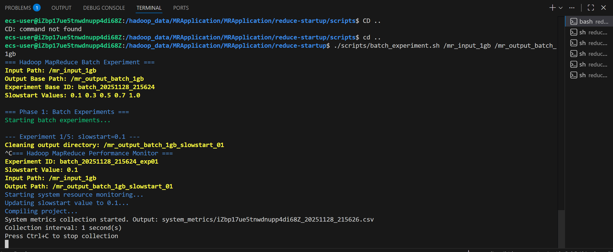
- 远端数据采集（4 个终端）：
  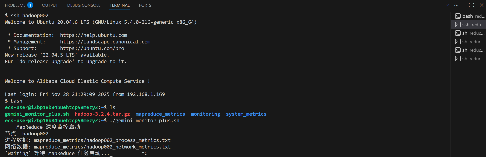
  
  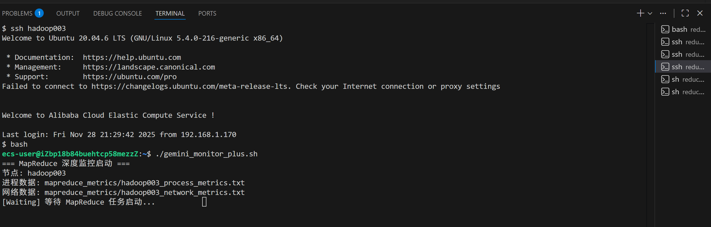
  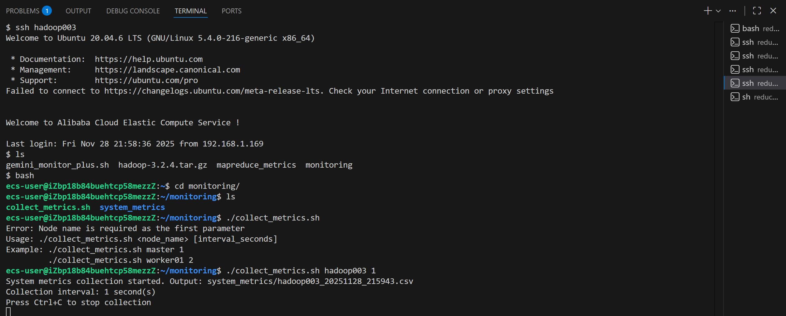
- hadoop001 本地采集：
  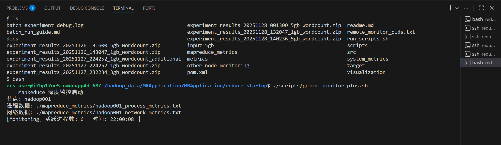

#### 结果采集

- 作业完成后，scripts/batch_experiment.sh 自动汇总所有所需数据与指标。
- 任务与系统监控示例：
  - Map/Reduce 任务监控：
    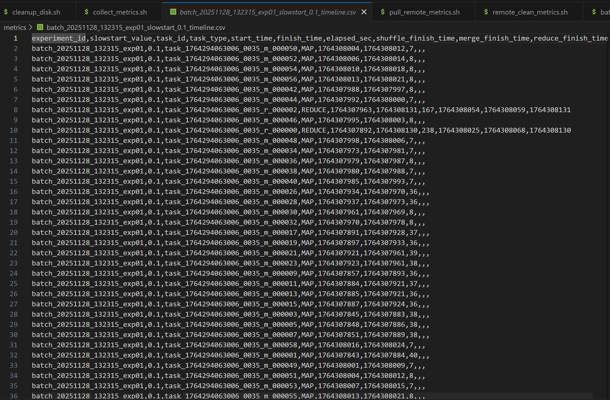
  - 系统监控：
    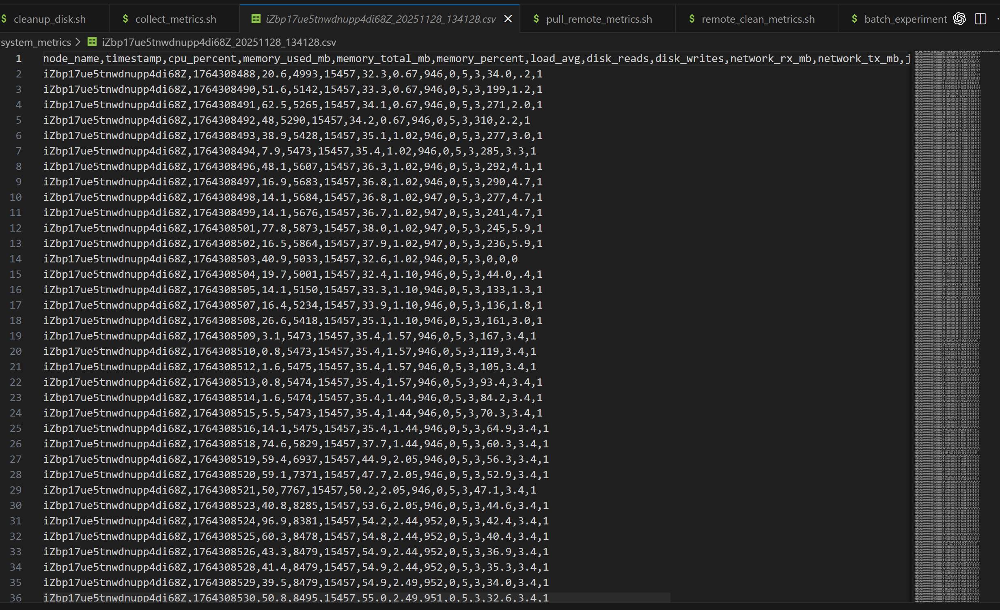
- 数据目录概览：
  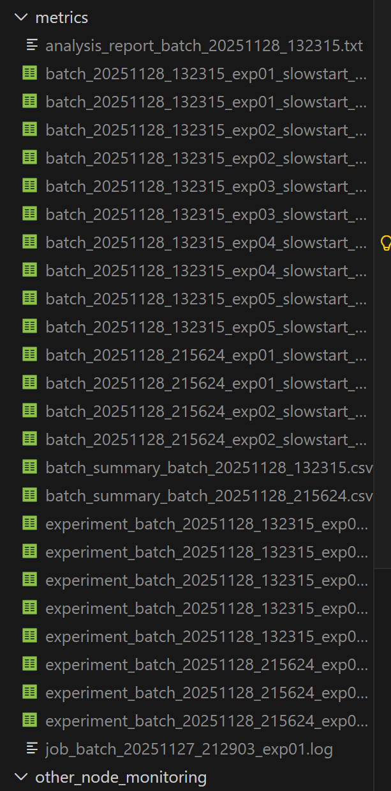

### 实验结果与分析

TODO: 周日前完成（建议用表格/图表对比不同 Reduce 启动策略的总耗时、资源利用率与 Shuffle 比例）
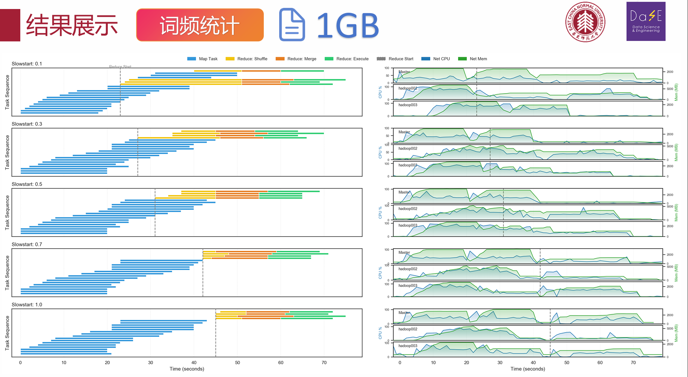

### 结论

TODO: 周日前完成

### 分工

TODO: 周日前完成
